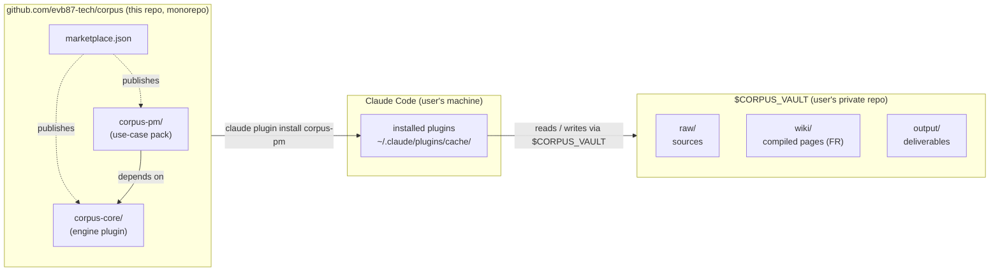
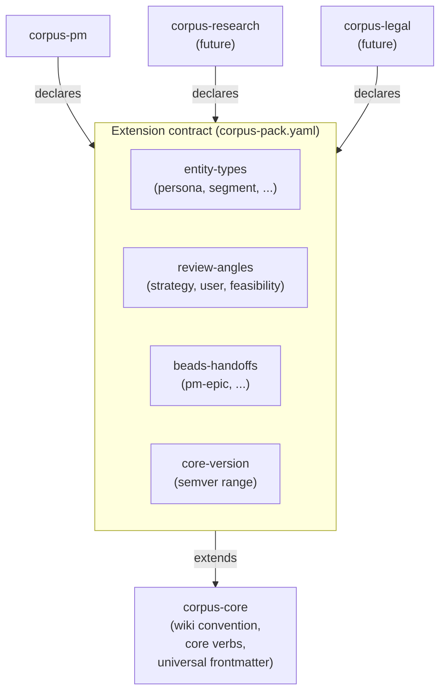
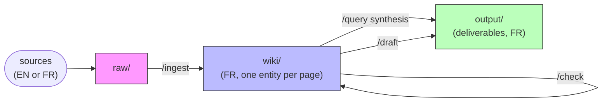

# Architecture

Why corpus is shaped the way it is. This doc covers the load-bearing decisions; the verbs and rules live in [`corpus-core/rules/`](./corpus-core/rules/), the plugin contract in [`docs/plugin-syntax.md`](./docs/plugin-syntax.md), and the repo-shape ADR in [`docs/decisions/0001-monorepo-shape.md`](./docs/decisions/0001-monorepo-shape.md).

## The shape

corpus is **a Claude Code plugin, not a TypeScript engine**. Prompts, rules, agents, slash commands. No build, no tests, no runtime. The plugin runs inside Claude Code; the user's content lives in a separate vault on disk; the env var `CORPUS_VAULT` is the only bridge.

Three artifacts, three locations, one environment variable that connects them. Everything else is detail.

## Why a plugin, not an engine

The first design draft was a `bun + TypeScript` engine that wrapped Claude API calls, with rules loaded as files at runtime. We deleted it (cor-7tf) before it shipped a single feature, for three reasons:

1. **The work is prompts and discipline, not code.** Ingestion, review, drafting — every operation is "Claude reads the right rules and produces the right output." Wrapping that in TypeScript adds a build step, a test surface, and a runtime to maintain, with zero new capability.
2. **Plugin format reaches the audience for free.** The target users already have Claude Code. `claude plugin install corpus-pm` is one command; `git clone && bun install && export PATH` is a different product.
3. **Slash commands are the right UX.** `/ingest`, `/query`, `/check`, `/draft` map cleanly to user intents. A CLI wrapper would invent its own command shape and immediately drift from the conversation.

The cost: corpus is bound to Claude Code as a runtime. If the plugin contract changes, we change with it. Acceptable — the alternative is rebuilding Claude Code's prompt-loading and tool-dispatch ourselves.

## Two-plugin model: core + packs

`corpus-core` ships the **wiki convention** (folder discipline, page format, ingestion protocol, three query postures, anti-lissage spec). It is use-case-agnostic.

`corpus-pm` is the **first use-case pack**: PM-flavoured second brain. It adds entity types (`persona`, `segment`, `competitor`, `interview`, `feature`, `decision`), review angles (strategy, user, feasibility), and a beads handoff for turning PRDs into structured issues.

Future packs (`corpus-research`, `corpus-legal`, etc.) extend corpus-core without forking it. The contract that makes this work is in [`corpus-core/rules/14-extension-contract.md`](./corpus-core/rules/14-extension-contract.md). Four extension points:

Pack discovery runs at command-invocation time: corpus-core globs `~/.claude/plugins/cache/*/corpus-pack.yaml`, parses each, verifies `core-version`, and merges the entity-type / review-angle / handoff registries into the runtime registry. No central registration; new packs work the moment they're installed. The discovery path is undocumented in the official Claude Code plugin reference (cor-erd) and may break if Anthropic relocates the cache — that risk is documented in [`docs/plugin-syntax.md`](./docs/plugin-syntax.md) §5.

## The wiki, the vault, the data flow

The Karpathy LLM-wiki pattern, extended with an explicit `output/` layer:

Three folders, three contracts:

- **`raw/` is read-only.** The owner curates what enters. Agents never write into it. If a source is wrong, the owner fixes it manually.
- **`wiki/` is agent-only.** The owner does not hand-edit. Pages are one-entity-per-page, French body, English structural keywords (frontmatter, fixed H2 names, filenames). Every claim cites a file in `raw/`. Contradictions surface as `type: stress-test` pages, never harmonized silently.
- **`output/` never feeds back into `wiki/`.** Wiki = what sources said. Output = what the owner concludes. The wall between them is the load-bearing constraint that prevents the wiki from drifting into the owner's opinions.

Three query postures, all reading the same wiki, producing different artifacts:

| Posture        | Asks                                          | Files back as                        |
| -------------- | --------------------------------------------- | ------------------------------------ |
| `research`     | "What do my sources say about X?"             | `wiki/<topic>.md` with `type: reference`     |
| `contradictor` | "Where does my wiki contradict itself or X?"  | `wiki/<topic>.md` with `type: stress-test`   |
| `synthesis`    | "Given my wiki, what should I conclude?"      | `output/<deliverable>.md` (never wiki)       |

The synthesis-doesn't-go-to-wiki rule is the second load-bearing constraint. It's enforced by the anti-lissage spec.

## Anti-lissage as differentiator

The anti-lissage spec ([`corpus-core/rules/10-anti-lissage.md`](./corpus-core/rules/10-anti-lissage.md)) names five LLM behaviors that destroy a knowledge base over time:

1. **Smoothing contradictions** into a unified view that no source actually held.
2. **Inventing sources** when the wiki is silent rather than admitting silence.
3. **Completing with training-data knowledge** without disclosing it.
4. **Drifting to averaged phrasing** that erases every author's voice.
5. **Over-summarizing** until the wiki stops being a faithful record and becomes a paraphrase.

Each behavior is suppressed by an explicit rule and a contract. Anti-lissage is what makes corpus a knowledge **archive** rather than a Claude-flavoured note-taking app: when the user asks "what did Author X actually say," the wiki preserves Author X's words verbatim, attributed, and contradictions to other authors are surfaced as their own pages.

## Why French body, English structural keywords

The audience is francophone AI strategic thinkers. Wiki content is in French because the owner is going to read it, write deliverables from it, and quote it in French-language work. Translation at ingestion is non-negotiable: an EN source gets read in EN and written into the wiki in FR, with verbatim quotes preserved in their original language.

Structural keywords stay English (`type:`, `sources:`, `last_updated:`, the fixed H2 sections like `Sources` and `Connexions` — well, those are FR section names that happen to look English, but the frontmatter keys are strictly English) for one reason: tooling. The librarian's lint, the extension contract, and any future cross-pack tooling rely on stable structural identifiers. Translating those into French would couple every tool to the FR locale.

## Why a separate vault

The vault is the user's content; corpus is the engine. Mixing them would mean either (a) every user's wiki lives in their fork of `evb87-tech/corpus`, which is privacy-hostile and fork-hell, or (b) corpus ships content, which conflicts with "no user content in this repo." The env var indirection costs one `export` line per session and buys clean separation.

A future cor-ydk decides whether editor integrations (Obsidian especially) auto-detect the vault or require explicit configuration. The current answer: explicit. If `$CORPUS_VAULT` is unset, every command refuses with a one-line "run `/init-vault <path>` then `export CORPUS_VAULT=<path>`."

## What's deliberately not in scope

- **No cloud sync, no service backend.** corpus runs locally. The vault syncs through the user's git remote, on their schedule, in their private repo.
- **No multi-user collaboration on a shared vault.** One user, one vault. Multi-user would require conflict resolution semantics the wiki's append-only-with-attribution model isn't designed for.
- **No automatic re-ingestion when sources change.** Re-running `/ingest <path>` on a changed source updates the wiki. There is no file-watcher, no daemon. Manual is correct at this scale.
- **No abstraction layer over Claude.** corpus is bound to Claude Code's plugin contract. If we ever need another runtime, we re-implement the prompts; we don't pretend to be runtime-agnostic now.

## Where to read next

- [`README.md`](./README.md) — what corpus does and how to install it.
- [`CONTRIBUTING.md`](./CONTRIBUTING.md) — how to add work, beads workflow, dispatch tiers.
- [`docs/plugin-syntax.md`](./docs/plugin-syntax.md) — the Claude Code plugin contract facts corpus depends on.
- [`docs/decisions/0001-monorepo-shape.md`](./docs/decisions/0001-monorepo-shape.md) — why one repo for two plugins.
- [`corpus-core/rules/14-extension-contract.md`](./corpus-core/rules/14-extension-contract.md) — the full pack contract specification.
- [`corpus-core/rules/10-anti-lissage.md`](./corpus-core/rules/10-anti-lissage.md) — the five suppressed behaviors.
