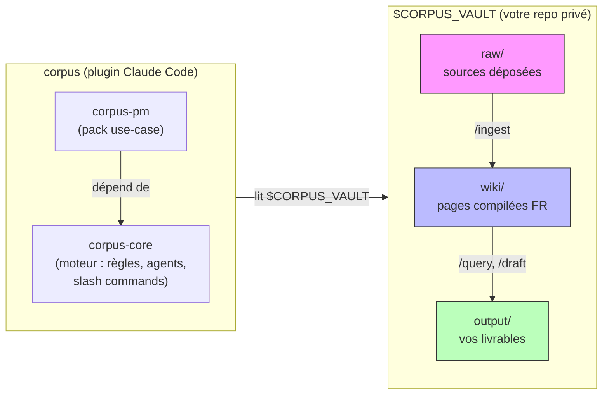

# corpus

Moteur de second cerveau curé par LLM. Vous déposez des sources dans un dossier ; Claude compile des pages wiki que vous interrogez sous trois postures et dont vous tirez des livrables. Schéma [LLM-wiki de Karpathy](https://gist.github.com/karpathy/442a6bf555914893e9891c11519de94f) étendu avec une couche `output/` explicite et une spec anti-lissage.

## Forme du repo

Deux plugins Claude Code dans un seul monorepo :

- **`corpus-core/`** — le moteur. Règles, agents, slash commands, spec anti-lissage. Agnostique du cas d'usage.
- **`corpus-pm/`** — premier pack use-case : second cerveau orienté PM. Ajoute des types d'entités, des angles de revue et des transferts vers beads. Dépend de corpus-core (installé automatiquement).

Un `marketplace.json` à la racine publie les deux. ADR de la forme : [`docs/decisions/0001-monorepo-shape.md`](./docs/decisions/0001-monorepo-shape.md). Contrat plugin : [`docs/plugin-syntax.md`](./docs/plugin-syntax.md). Vue d'ensemble avec diagrammes : [`ARCHITECTURE.md`](./ARCHITECTURE.md).



Le moteur vit dans ce repo. Le vault et son contenu vivent séparément.

## Installation

Une fois la marketplace publiée :

```bash
claude plugin install corpus-core      # moteur seul
claude plugin install corpus-pm        # pack PM (tire corpus-core automatiquement)
```

Tant que la marketplace n'est pas publiée, installez depuis un clone local — voir [`docs/plugin-syntax.md`](./docs/plugin-syntax.md).

## Bootstrap du vault

```bash
/init-vault ~/Documents/mon-vault
export CORPUS_VAULT=~/Documents/mon-vault
```

`/init-vault` crée le dossier, le marker `.corpus-vault`, et la structure suivante :

```
$CORPUS_VAULT/
├── raw/            sources (lecture seule pour les agents)
├── wiki/           pages compilées (écritures agents uniquement, contenu FR)
├── output/         livrables (briefs, synthèses)
├── .obsidian/      config Obsidian (locale au vault)
└── .corpus-vault   marker
```

Si `$CORPUS_VAULT` n'est pas défini, toutes les commandes refusent de s'exécuter.

## Usage quotidien

- `/ingest [chemin]` — lit une source depuis `raw/`, compile les pages entités dans `wiki/`
- `/query [posture] <question>` — interroge le wiki (postures : research / contradictor / synthesis)
- `/check` — passe de lint complet sur le wiki
- `/draft <description>` — produit un livrable dans `output/`

## corpus-pm — pack produit

corpus-pm est optionnel mais c'est le cas d'usage principal. Il enregistre dans le moteur :

**Six types d'entités wiki** : `persona`, `segment`, `competitor`, `interview`, `feature`, `decision`.

**Trois angles de revue** qui lisent vos drafts dans `output/` et produisent des pages `type: stress-test` dans le wiki : `strategy`, `user`, `feasibility`.

**Un transfert beads** (`pm-epic`) qui décompose un PRD en epics et sous-tâches structurées.

corpus-pm n'existe pas sans corpus-core mais n'en modifie aucune règle — il étend seulement les registres.

## Spec

Les règles effectives sont dans [`corpus-core/rules/`](corpus-core/rules/), chargées à la demande :

- `01-folder-discipline.md` — moteur vs. vault, ce que chaque dossier contient, ce qui est en lecture seule
- `02-wiki-page-format.md` — frontmatter, sections (FR), `index.md`, `log.md`
- `03-ingestion-protocol.md` — workflow `/ingest`, règle de traduction EN→FR, ~10–15 pages par source
- `04-output-drafting.md` — workflow `/draft`, formats de sortie (Marp, tableaux, graphes)
- `05-query-postures.md` — research / contradictor / synthesis, règles de fichier-retour
- `06-maintenance-check.md` — lint `/check`, périmètre complet Karpathy
- `07-anti-lissage.md` — cinq comportements LLM qui détruisent un wiki, supprimés
- `08-vault-structure.md` — layout du vault, conventions Obsidian, commande `init-vault`
- `09-extension-contract.md` — comment les packs use-case étendent corpus-core
- `10-contribution-workflow.md` — cycle bead → branche → PR → revue → merge

[`CLAUDE.md`](./CLAUDE.md) et [`AGENTS.md`](./AGENTS.md) sont les manifestes qui pointent vers ces règles. [`ARCHITECTURE.md`](./ARCHITECTURE.md) couvre les décisions de conception avec des diagrammes du flux de données et du modèle d'extension.

## Règles dures (extrait)

- Le contenu du wiki est en **français**. Les sources peuvent être EN ou FR (traduites à l'ingestion). Frontmatter et noms de section restent en anglais.
- Ne jamais écrire dans `raw/`. Ne jamais écrire dans `output/` depuis l'ingestion. Ne jamais écrire dans `wiki/` depuis le drafting.
- Ne jamais inventer une source. Ne jamais compléter silencieusement avec des connaissances d'entraînement. Ne jamais harmoniser des contradictions.
- Ne jamais produire une page `type: synthesis` dans le wiki. La synthèse va dans `output/`.
- `output/` ne réalimente jamais `wiki/`. Wiki = ce que les sources disent. Output = ce que le propriétaire conclut.

## Outils

- **Runtime :** Claude Code (format plugin). Pas de build, pas de TypeScript — corpus est des prompts, des règles et des slash commands.
- **Suivi de travail :** [beads](https://github.com/dogmata-dev/beads) (préfixe `cor-`). Voir [`CONTRIBUTING.md`](./CONTRIBUTING.md).
- **Licence :** MIT — voir [LICENSE](./LICENSE).

## Inspiration

[LLM-wiki gist de Karpathy](https://gist.github.com/karpathy/442a6bf555914893e9891c11519de94f). Extensions apportées par corpus : couche `output/` explicite, trois postures de query (research / contradictor / synthesis), spec anti-lissage.
